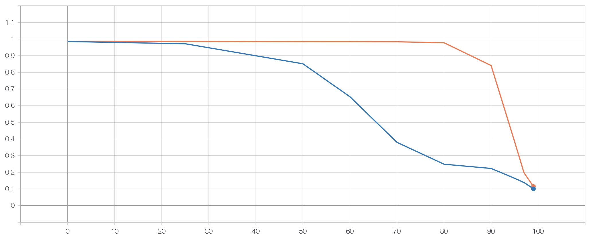

# pruning

### Structure
`model.py` contains model itself

`train.py` creates, trains and saves the model

`eval.py` performs evaluation of trained model using specified pruning method

`utils.py` contains signle function for evaluating model on test data 

### Reproducing
```bash
python3 train.py
python3 eval.py --sparcity "weight"
python3 eval.py --sparcity "unit"
```

### Results

#### Pruning


You can see plots by calling `tensorboard --logdir .` in project dirrectory. 
It will be availbe at `localhost`.

Orange plot is the result of applying weight pruning 
with different percentage of zero weights, while blue plot stands for unit pruning.

This result was quite predictable, 
since weight pruning seems to be more careful (and thus more accurate) – 
units with high norm could contain small number of 
big weights with the rest of weights being close to zero.

Interesting part in this plots is that even with 80% of zero weights, 
weight pruning still produce good (or at least, not so bad) results 
having approximately 97.8% of accuracy versus 98.5% of accuracy in unpruned network.

By the way, I believe that in order to reach outstanding sparsity rates, instead of 
using naive heuristic approaches like weight or unit pruning, we have to
train nets in such way, that they are going to be sparse 
on its own (L0 regularization, Variational Dropout, etc).

Also I am not really sure that network pruning is the best way to make network smaller,
since we have to use specific software to handle sparse computations if our model is complex enough.
From the perspective of training small networks, 
I believe in model distillation methods, since they allows us significantly reduce model size without
any need in sparse computations.

#### Sparsity optimization
I added ability to optimize the model with sparse weights.

For example, measurement of mean evaluation speed for weight pruning with 90% of zero weights
with batch of 100 28x28 images is
```
no optimization time 0.00790979766845703
optimization time 0.0018504085540771485
```

Results for unit pruning with the same sparsity rate is
```
no optimization time 0.0074618573188781736
optimization time 0.0013431077003479004
```

Optimization works by casting weight matrix of linear layer to `torch.sparse.Tensor` and performing 
matrix multiplication with this sparse matrix.